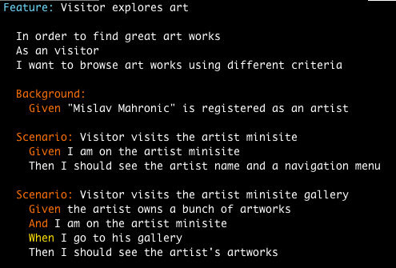
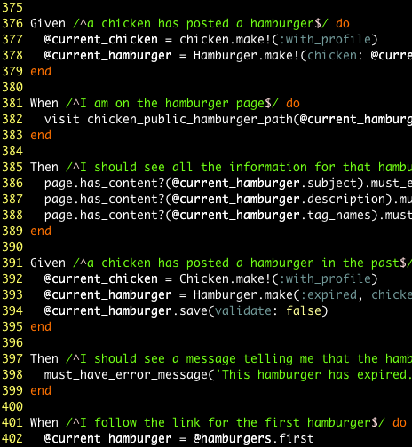
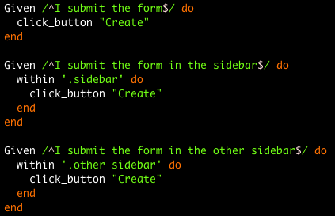
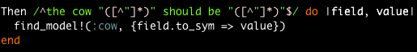

!SLIDE bullets incremental
# Gherkin #
* Natural-ish DSL
* The language behind Cucumber
* Abstract feature description
* Focus on business value (*In order to...*)

!SLIDE center

!SLIDE

# What *sucks* about Cucumber #

!SLIDE center

# Step MADNESS #

!SLIDE center

# Step ambiguity #

!SLIDE center

# Regex-based step matching #
Reusable Cucumber steps == Ugly steps

(regexes matching a shitload of different cases)

!SLIDE
## We love Gherkin, *not* Cucumber ##
so ...
