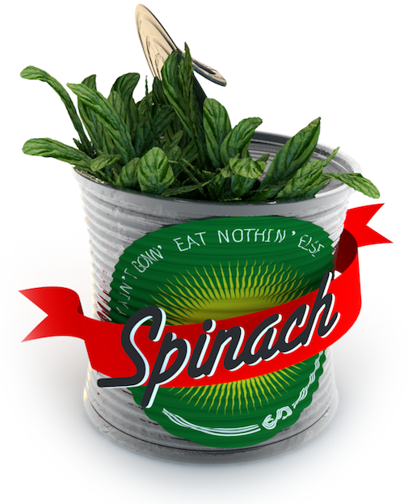
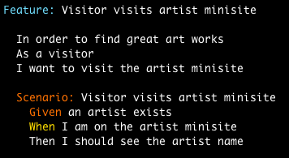
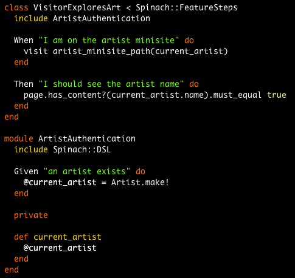

!SLIDE center

## /spɪnɪtʃ/ ##

!SLIDE bullets incremental center

* Features are just *Ruby classes*
* Leverages *Gherkin* parser
* Steps are *just Ruby methods*
* Supports MiniTest and RSpec, with Capybara, etc

!SLIDE incremental center

!SLIDE incremental bullets
# Fighting *step madness* and *ambiguity* #

* Each feature has its own steps (no global steps)
* *Explicit* reusability through Ruby mixins

!SLIDE incremental bullets
# Simple architecture #

* Small codebase
* Fully documented
* Simple hooks system

!SLIDE incremental bullets
# Ruby compatibility #

* MRI 1.9
* Rubinius/JRuby on the works

!SLIDE incremental bullets
# Web framework compatibility #

* spinach-rails
* Any rack-based framework (Sinatra, Padrino, etc...)

!SLIDE incremental bullets
# One step further #

* Pregenerated features/steps packaged as gems
* ?

!SLIDE incremental bullets
# Thank you! #

* http://github.com/codegram/spinach
* http://github.com/codegram/spinach-rails

!SLIDE
# Q & A #
